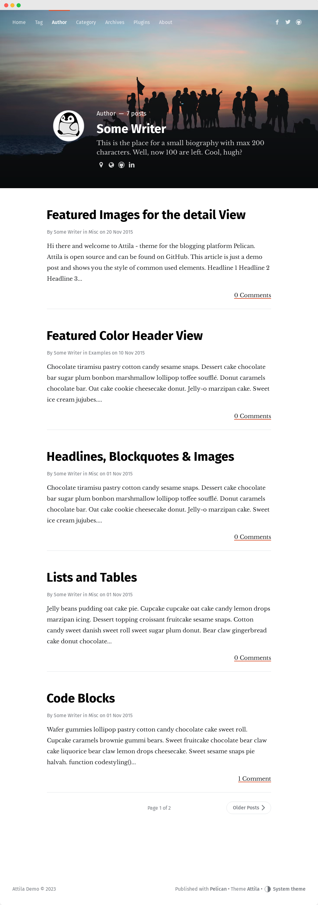

[[pelican-attila-theme]]
= Attila
A content focused responsive pelican theme

:toc: left

[[overview]]
== Overview

A content focused responsive theme for
https://github.com/getpelican/pelican[Pelican].

It is ported from ghost theme
https://github.com/zutrinken/attila[attila]

[[demo]]
== Demo

* https://attila.demo.arulraj.net[Blog]
* https://attila.demo.arulraj.net/2015/11/headlines-blockquotes-images/[Post]
* https://attila.demo.arulraj.net/tag/general/[Tag Archive]
* https://attila.demo.arulraj.net/author/pelican/[Author
Archive]
* https://attila.demo.arulraj.net/archive/[All archive]
* https://attila.demo.arulraj.net/pages/about/[Page]

Demo blog https://github.com/arulrajnet/attila-demo[source code]

[[install]]
== Install

The recommend way to install is using pelican-themes command.

* Download latest zip from
https://github.com/arulrajnet/attila/releases[release]
* Unzip that file
* Then `sudo pelican-themes -U attila` . Here attila is the extracted
folder name
* Now list all themes `sudo pelican-themes -l`
* Use that theme name in your pelicanconf.py

[[features]]
== Features

* Responsive layout
* Navigation support
* Paralax cover images for posts, author archives and blog
* Author informations for posts and author archives
* Featured posts (via
https://github.com/getpelican/pelican-plugins/tree/master/neighbors[plugin])
* Reading progress for posts
* Automatic code syntax highlight
* Disqus support
* Google Analytics, GAUGES and PIWIKI
* Sharing buttons
* Open Graph
* Rich Snippets (JSON-LD)

[[configuration]]
== Configurations

The attila docs hosted in http://arulrajnet.github.io/attila[attila-docs]

[[setup-a-blog]]
=== Setup a blog

Refer
https://github.com/arulrajnet/attila-demo/blob/master/pelicanconf.py[more
setting]

Here are all configurations about this theme.

[[header-covers]]
=== Header Covers

You can set cover images for your blog, article, page, tag, category and author. The cover images can be from your relative path or from internet.

[[blog-cover]]
==== Blog Cover

The is the cover image for your site main index.html.

To set blog cover, set the property `HOME_COVER` in
`pelicanconf.py`:

[source,python]
----
HOME_COVER = '/assets/images/blog_cover.png'
----

[NOTE]
====
HEADER_COVER property is deprecated. Work around will be use HOME_COVER and use cover in individual articles.
This property will be used if there is no cover image set to an article, page, tag, category, author.
====

[[article-cover]]
==== Article Cover

To set different cover image for an article set `cover` metadata in front-matter.

[source,python]
----
:title: With Cover Images
:date: 2018-04-29 00:45
:author: arul
:category: foo
:tags: footag
:slug: with-cover-images
:cover: /assets/images/article_cover.jpg
----

For more refer link:#articles[article] .

[[page-cover]]
==== Page Cover

To set different cover image for a page set `cover` metadata in front-matter.

[source,python]
----
:title: Page With Cover Images
:date: 2018-04-29 00:45
:author: arul
:category: foo
:tags: footag
:slug: page-with-cover-images
:cover: assets/images/page_cover.jpg
----

For more refer link:#articles[article] .

[[tag-cover]]
==== Tag Cover

To set cover image for a tag, set the property `TAG_META` in
`pelicanconf.py`:

[source,python]
----
TAG_META = {
  'food': {
    'cover': '/images/food.png',
    'description': 'Examples ipsum dolor sit amet. Topping'
  },
  'drinks': {
    'cover': '/images/orange-juice.png',
    'description': 'Examples ipsum dolor sit amet. Juice'
  }
}
----

[[category-cover]]
==== Category Cover

To set cover image for a category, set the property `CATEGORY_META` in
`pelicanconf.py`:

[source,python]
----
CATEGORY_META = {
  'food': {
    'cover': '/images/junkie-stuff.png',
    'description': 'Examples ipsum dolor sit amet. Topping'
  }
}
----

[[author-cover]]
==== Author Cover

To set cover image for an author, set the property `AUTHOR_META` in `pelicanconf.py`:

[source,python]
----
AUTHOR_META = {
  "zutrinken": {
    "cover": "/assets/images/zutrinken-cover.png"
  }
}
----

For more refer link:#author-bio[author] .

[[header-color]]
=== Header Color

To define a simple header background color, set the property
`HOME_COLOR` in `pelicanconf.py`:

[source,python]
----
HOME_COLOR = 'black'
----

you can use any valid css color. This will be used if there is no cover
image set in link:#articles[article] level and site level.

[NOTE]
====
HEADER_COLOR property is deprecated. Work around will be use HOME_COLOR and use color in individual articles.
This property will be used if there is no HEADER_COVER and cover image set to an article, page, tag, category, author.
====

[[social-urls]]
=== Social URLs

Github, Twitter and Facebook URLs set these properties:

[source,python]
----
SOCIAL = (('twitter', 'https://twitter.com/myprofile'),
          ('github', 'https://github.com/myprofile'),
          ('facebook','https://facebook.com/myprofile'),
          ('flickr','https://www.flickr.com/myprofile/'),
          ('envelope','mailto:my@mail.address'))
----

[[external-feed-url]]
=== External feed URL

You can specify an external feed URL (e.g. FeedBurner) in `SOCIAL` using
the `rss` or `rss-square` or `feed` icons. A `<link>` tag for the
external feed will be placed in `<head>` instead of the default Pelican
feeds.

[[user-defined-css]]
=== User defined CSS

Define `CSS_OVERRIDE` in `pelicanconf.py` to insert a user defined CSS
file after theme CSS. Example:

Array of CSS you can give

[source,python]
----
CSS_OVERRIDE = ['css/myblog.css']
----

[[user-defined-script]]
=== User defined script

[source,python]
----
JS_OVERRIDE = ['']
----

[[author-bio]]
=== Author Bio

....
AUTHOR_META = {
  "zutrinken": {
    "name": "Zutrinken",
    "cover": "https://attila.demo.arulraj.net/assets/images/avatar.png",
    "image": "https://attila.demo.arulraj.net/assets/images/avatar.png",
    "website": "http://blog.arulraj.net",
    "location": "Chennai",
    "bio": "This is the place for a small biography with max 200 characters. Well, now 100 are left. Cool, hugh?"
  }
}
....

The supported social profile for author are `facebook`, `github`, `linkedin`, `twitter` and `instagram`.

[[analytics]]
=== Analytics

Accept many analytics:

* Google Analytics: `GOOGLE_ANALYTICS`;
* Gauges: `GAUGES`
* Piwik: `PIWIK_URL` and `PIWIK_SITE_ID`.

[[menu-items]]
=== Menu Items

The menu item coming from pelican config `MENUITEMS`.

For ex:

[source,python]
----
MENUITEMS = (('Home', '/'),
             ('Tag', '/tag/getting-started/'),
             ('Author', '/author/pelican/'),
             ('Category', '/category/examples/'),
             ('Archives','/2015/11/'),
             ('Plugins', 'https://github.com/pelican-plugins'))
----

[[articles]]
=== Article Cover

* To customize header color to articles, insert the metadata `color`.
* To customize header cover to articles, insert the metadata `cover`,
otherwise `og_image` or `HEADER_COVER` will be used.
* To customize OpenGraph images, insert the metadata `og_image`,
otherwise `cover`, `HEADER_COVER` or a
https://github.com/arulrajnet/attila/blob/master/static/images/post-bg.jpg[default
image] from theme will be used.
* To customize Twitter card images, insert the metadata `twitter_image`,
otherwise `header_cover`, `HEADER_COVER` or a default image from theme
will be used. Twitter cards will be generated automatically if the
`twitter` account is configured in `SOCIAL`!

All image paths are relative from the site root directory. You can also
use absolute URLs for `og_image` and `twitter_image`.

[[tag-cloud]]
=== Tag Cloud

Attila renders tags page as a tag cloud.

Use `TAG_CLOUD_STEPS` configuration variable to specify number of font size
steps for the tag cloud. Default value is 5, stylesheet is written to support
up to 10 steps. If you want more steps, you'll need to configure your CSS
manually (see `CSS_OVERRIDE`)

[[other-configuration]]
=== Other configuration

* Set `FACEBOOK_ADMINS` to a list of Facebook account IDs which are
associated with this blog. For example `['12345']`. For more info see
https://developers.facebook.com/docs/platforminsights/domains
* `GOOGLE_SITE_VERIFICATION` - Google site verification token.
* Set `SHOW_ARTICLE_MODIFIED_TIME` to `True` to show the article modified time along with created time. Default is `False`.
* Set `SHOW_AUTHOR_BIO_IN_ARTICLE` to `True` to show the bio of author in end of the each article. Default is `False`.
* Set `SHOW_CATEGORIES_ON_MENU` to `True` to show the categories as menu item at the top. Default is `False`.
* Set `SHOW_COMMENTS_COUNT_IN_ARTICLE_SUMMARY` to `True` to show the comments count in article summary. Default is `True`.
* Set `SHOW_CREDITS` to `True` to show the credits of the theme at the bottom. Default is `True`.
* Set `SHOW_FULL_ARTICLE_IN_SUMMARY` to True to show full article content on
index.html instead of summary. Default is `False`.
* Set `SHOW_PAGES_ON_MENU` to `True` to show the each page as separate menu item. Default is `True`.
* Set `SHOW_SITESUBTITLE_IN_HTML_TITLE` to `True` to show the site description (Set using variable `SITESUBTITLE`) after site name. Default is `False`.
* Set `SHOW_TAGS_IN_ARTICLE_SUMMARY` to `True` to show the tags in article summary. Default is `False`.

[[development]]
== Development

refer this https://github.com/arulrajnet/attila-demo

*Author Screen* 

[[contributing]]
=== Contributing

Always open an issue before sending a PR. Talk about the problem/feature
that you want to fix. If it’s really a good thing you can submit your
PR. If you send an PR without talking about before what it is, you may
work for nothing.

As always, if you want something that only make sense to you, just fork
attila and start a new theme.

[[donate]]
== Donate

Did you liked this theme? Pay my bills and support new features.

https://github.com/sponsors/arulrajnet/[image:https://img.shields.io/github/sponsors/arulrajnet?style=for-the-badge[GitHub Sponsors]]

[[copyright-license]]
== Copyright & License

Copyright (c) 2015-2016 Peter Amende - Released under The MIT License.

Copyright (c) 2016 Arulraj V - Released under The MIT License.

Some background images used from
https://github.com/gilsondev/pelican-clean-blog
